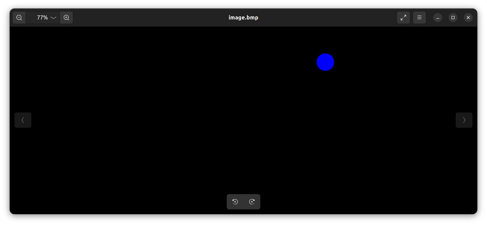
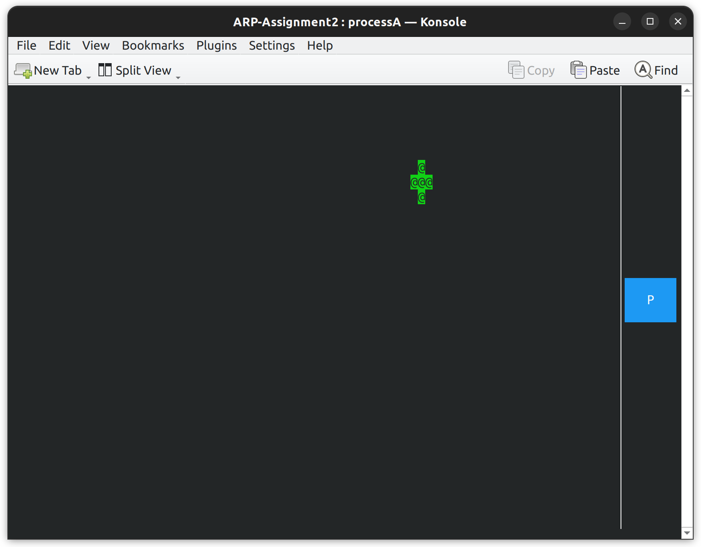
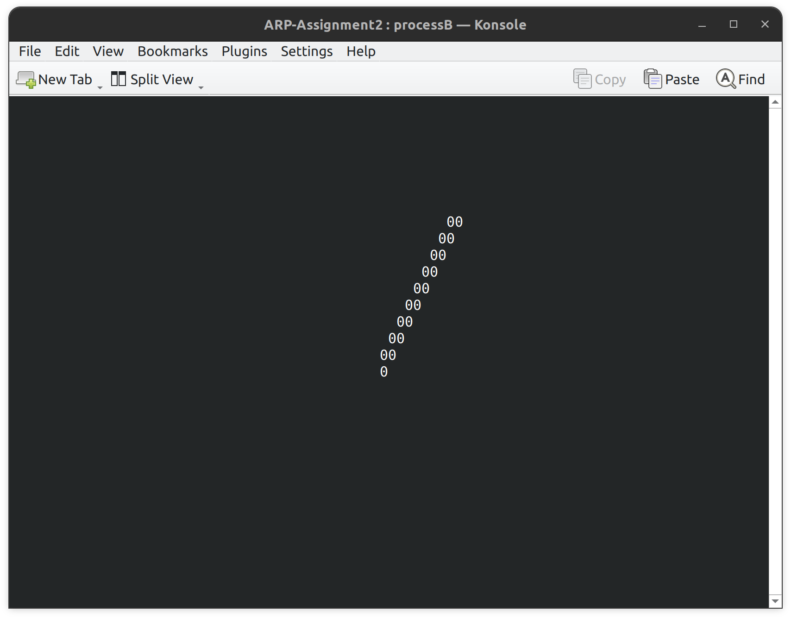

# ARP-Assignment2
Yassin Farah 4801788
## Description
This second *Advanced and Robot Programming* (ARP) assignment consists in creating two processes, one that simulates the acquirement of an image and the other one that processes it, trying to find the position of the centre of a circle inside of the image, such as in the following picture.



The position of the circle is commanded by the first process, using a ncurses window, in which, using the arrow keys, we can move the representation of the circle. In the window there's also a **P** button and by pressing it a copy of the image will be saved.



The position of the circle is then computed by the second process, that, using also a ncurses window, displays the position.



## Folders content

The repository is organized as it follows:
- the `src` folder contains the source code for all the processes
- the `include` folder contains all the data structures and methods used within the ncurses framework to build the two GUIs

After compiling the program other two directories will be created:

- the `bin` folder contains all the executable files
- the `out` folder will contain the saved image as a *bmp* file

## Processes
The program is composed of 3 processes:
-  `processA.c` will create a *ncurses* window in which a representation of the circle is displayed. It will also create a *bitmap* file containing the circle in the given position and, whenever the circle changes position, it will communicate it to `processB.c` by updating a copy of the bitmap in the shared memory. Furthermore, when clicking the button **P**, a copy of the image will be saved in the `out` folder.
-  `processB.c` will create a *ncurses* window in which the centre of the circle is displayed. To do so, it will create a local copy of the bitmap, update it by reading the shared memory and compute the centre of the circle.
-  `master.c` will create the mutex semaphore that the two processes need to read and write consistent data and then launch the two processes as children. It will also monitor the status of the two processes and, in case one of them terminates unexpectedly, it will kill the other one and print an error message.


## Requirements
The program requires the installation of the **konsole** program, of the **ncurses** library and of the **bitmap** library. To install the konsole program, simply open a terminal and type the following command:
```console
$ sudo apt-get install konsole
```
To install the ncurses library, type the following command:
```console
$ sudo apt-get install libncurses-dev
```

To install the bitmap library, you need to follow these steps:
1. Download the source code from [this GitHub repo](https://github.com/draekko/libbitmap.git) in your file system.
2. Navigate to the root directory of the downloaded repo and run the configuration through command ```./configure```. Configuration might take a while.  While running, it prints some messages telling which features it is checking for.
3. Type ```make``` to compile the package.
4. Run ```make install``` to install the programs and any data files and documentation.
5. Upon completing the installation, check that the files have been properly installed by navigating to ```/usr/local/lib```, where you should find the ```libbmp.so``` shared library ready for use.
6. In order to properly compile programs which use the *libbitmap* library, you first need to notify the **linker** about the location of the shared library. To do that, you can simply add the following line at the end of your ```.bashrc``` file:      
```export LD_LIBRARY_PATH="/usr/local/lib:$LD_LIBRARY_PATH"```

## Compiling and running the code
Two shell scripts have been provided to compile and run the code. To compile the code simply open a terminal from inside the directory and type the following command:
```console
$ bash compile.sh
```
To run the code type the following command:
```console
$ bash run.sh
```
To work properly, the window related to `processA.c` needs to be 90x30 and the window related to `processB.c` needs to be 80x30.